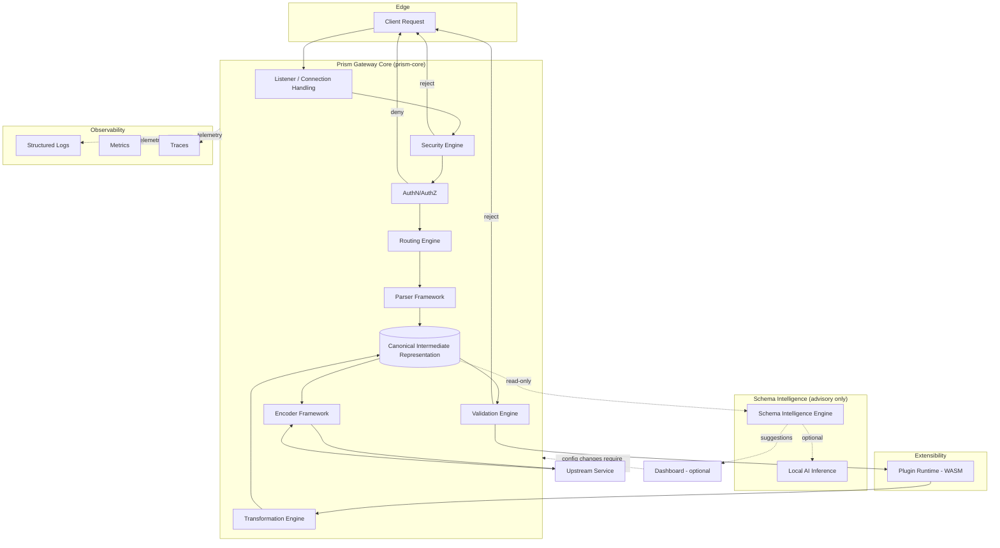
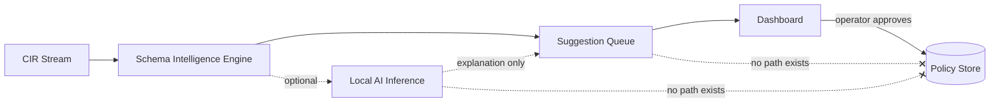

# Prism Gateway — Architecture

**Status:** Living document. Reflects the architecture as of the `v0.1` development line.
**Audience:** Contributors, integrators, and operators who need to understand how Prism is built and why.

This document describes the internal architecture of Prism Gateway: how requests move through the system, how the Canonical Intermediate Representation (CIR) works, how security and transformation are separated, and the tradeoffs behind each major decision. It does not describe how to *use* Prism — see `README.md` and the `docs/` directory for operational and user-facing guides.

---

## Table of Contents

1. [Project Overview](#1-project-overview)
2. [Design Philosophy](#2-design-philosophy)
3. [Architectural Principles](#3-architectural-principles)
4. [High-Level Architecture](#4-high-level-architecture)
5. [Request Lifecycle](#5-request-lifecycle)
6. [Routing Engine](#6-routing-engine)
7. [Canonical Intermediate Representation (CIR)](#7-canonical-intermediate-representation-cir)
8. [Parser Framework](#8-parser-framework)
9. [Encoder Framework](#9-encoder-framework)
10. [Transformation Engine](#10-transformation-engine)
11. [Validation Engine](#11-validation-engine)
12. [Security Engine](#12-security-engine)
13. [Authentication](#13-authentication)
14. [Authorization](#14-authorization)
15. [Schema Intelligence Engine](#15-schema-intelligence-engine)
16. [Local AI Architecture](#16-local-ai-architecture)
17. [Plugin System](#17-plugin-system)
18. [WebAssembly Support](#18-webassembly-support)
19. [Dashboard Architecture](#19-dashboard-architecture)
20. [Configuration System](#20-configuration-system)
21. [Deployment Models](#21-deployment-models)
22. [Concurrency Model](#22-concurrency-model)
23. [Async Runtime](#23-async-runtime)
24. [Memory Management](#24-memory-management)
25. [Error Handling Philosophy](#25-error-handling-philosophy)
26. [Logging](#26-logging)
27. [Metrics](#27-metrics)
28. [Tracing](#28-tracing)
29. [Observability Summary](#29-observability-summary)
30. [Testing Architecture](#30-testing-architecture)
31. [Repository Structure](#31-repository-structure)
32. [Dependency Philosophy](#32-dependency-philosophy)
33. [Future Architecture](#33-future-architecture)
34. [Tradeoffs](#34-tradeoffs)
35. [Security Boundaries](#35-security-boundaries)

---

## 1. Project Overview

Prism Gateway is a security-first API gateway written in Rust. It sits between untrusted clients and internal services, and performs three jobs that most gateways treat as separate concerns bolted together after the fact:

1. **Security enforcement** — validating, sanitizing, and authorizing every request before it is parsed into a usable structure.
2. **Format normalization** — converting arbitrary input payloads (JSON, YAML, TOML, XML, MessagePack, Protocol Buffers, Avro, CBOR) into a single internal representation, and back out into whatever format a downstream service expects.
3. **Operational visibility** — giving operators a way to see, understand, and reason about what the gateway is doing, both through structured telemetry and through an optional visual dashboard.

Most existing gateways (Envoy, Kong, Traefik, Nginx-based solutions) are excellent at routing and load balancing but treat payload transformation as an afterthought, usually delegated to Lua scripts, external sidecars, or hand-written middleware. Prism inverts this: transformation is a first-class, statically-typed pipeline stage, and security validation happens *before* a payload is even parsed into a structured form, not after.

Prism is not a service mesh, not a general-purpose reverse proxy, and not an ESB. It is deliberately scoped to be an edge and internal API gateway that understands the *shape* and *safety* of the data flowing through it.

---

## 2. Design Philosophy

Prism's architecture is derived from a small number of philosophical commitments. Every subsystem described in this document is a consequence of these commitments, not an independent design choice.

### 2.1 Security Is Not a Layer, It's an Order of Operations

Many gateways implement security as a plugin that runs "somewhere" in a request pipeline, often after the body has already been parsed and partially trusted. Prism's security engine runs against the **raw, unparsed byte stream** first. Structural parsing (turning bytes into a CIR document) is treated as an operation that itself must be defended — a malicious payload should never be able to reach a parser that hasn't already been told what it's allowed to look like.

### 2.2 Determinism Over Cleverness

Given identical input, configuration, and policy state, Prism must produce identical output. This sounds obvious, but it rules out a number of common gateway patterns:

- No hidden caching that changes behavior based on unrelated prior requests.
- No AI-driven runtime behavior changes without an explicit, versioned, human-approved configuration change.
- No implicit schema coercion that "guesses" what the client meant.

Determinism is what makes a gateway auditable. If an engineer cannot predict what the gateway will do with a given request by reading the configuration, the gateway has failed at its job.

### 2.3 Advisory Intelligence, Not Autonomous Intelligence

Prism's Schema Intelligence Engine and optional local AI assistant are explicitly restricted to **advisory** roles. They may propose schemas, flag anomalies, and suggest validation rules. They may never write to the active configuration store, and no code path exists by which an inference result becomes enforced policy without an explicit human action (a config commit, a dashboard "Approve" click, or a signed policy update). This is enforced architecturally — advisory subsystems do not hold a reference to the policy store's write handle. See [Section 16](#16-local-ai-architecture) for the specifics.

### 2.4 Offline-First, Cloud-Optional

Every core capability — parsing, transformation, validation, authentication, authorization, schema inference, and even AI-assisted suggestions — must function with no outbound network access. Cloud integrations (hosted vulnerability feeds, remote policy sync, managed dashboards) are additive, never load-bearing. A network partition must never turn into a security or availability incident for the gateway itself.

### 2.5 Boring Where It Matters

Prism intentionally avoids novelty in the places where novelty is dangerous: cryptography, memory safety, and dependency parsing. These layers use well-reviewed, widely-audited crates rather than hand-rolled implementations. Novelty is reserved for the parts of the system that actually benefit from a fresh approach — CIR design, transformation ergonomics, and the visual pipeline designer.

---

## 3. Architectural Principles

| Principle | Practical Consequence |
|---|---|
| Security before functionality | Security engine executes before parsing; parsing executes before transformation |
| Deterministic behavior | No runtime behavior may depend on unversioned state |
| Offline-first | No subsystem may require network access to function at a reduced-but-safe capability level |
| Zero-trust | Every request is authenticated and authorized regardless of network origin |
| Memory safety | `unsafe` is forbidden outside of a small, audited allowlist (see `SECURITY.md`) |
| Modular architecture | Every major subsystem is a separate crate with an explicit trait-based interface |
| Plugin extensibility | External behavior is added via WASM plugins with capability-scoped permissions, not compiled-in forks |
| Self-hosted by default | The reference deployment is a single static binary with no mandatory external dependencies |

---

## 4. High-Level Architecture

Prism is organized as a Cargo workspace of focused crates, composed at runtime into a single pipeline. The diagram below shows the major subsystems and the direction of data flow for a typical request.



Key structural properties visible in this diagram:

- The **Schema Intelligence Engine** only ever *reads* from the CIR pipeline. It has no write path back into `Core`. Any change it proposes surfaces in the Dashboard and requires an explicit operator action to become configuration.
- The **Security Engine** runs before **Authentication/Authorization**, which runs before **Routing**, which runs before **Parsing**. A request that fails security screening never reaches a format parser.
- **Plugins** execute inside the pipeline but only at explicitly defined extension points (post-validation, pre/post-transformation), never as a replacement for core security or parsing logic.

---

## 5. Request Lifecycle

Every request passes through a fixed, ordered pipeline. Stages cannot be reordered by configuration — only enabled, disabled, or parameterized. This fixed ordering is a deliberate constraint: it is what makes the system's security guarantees provable by inspection rather than by exhaustive testing of configuration permutations.

```
 1. Connection accepted (TLS termination if configured)
 2. Raw byte-level security screening
        - payload size limits
        - content-type allowlist check
        - header validation
        - rate limiting
 3. Authentication
        - credential extraction
        - credential verification
 4. Authorization
        - route-level policy evaluation
 5. Route resolution
        - path/method/host matching
        - version resolution
 6. Parsing
        - raw bytes -> CIR, using the format-specific parser
 7. Structural + semantic validation
        - CIR validated against configured schema/policy
 8. Plugin hooks (pre-transform)
 9. Transformation
        - CIR -> CIR transformation rules applied
10. Plugin hooks (post-transform)
11. Encoding
        - CIR -> target format bytes
12. Upstream dispatch
13. Response path (steps 6-11 run in reverse for the response body,
        subject to independent response-side policy)
14. Telemetry emission (logs, metrics, spans) at every stage boundary
```

Each numbered stage corresponds to a distinct, independently testable module. A failure at any stage short-circuits the pipeline and produces a structured error response; later stages never execute speculatively.

### 5.1 Why Screening Precedes Parsing

A parser is itself an attack surface — XML entity expansion, deeply nested JSON, and malformed Protobuf messages have all been used historically to exhaust memory or CPU. Prism performs size, encoding, and content-type checks against the raw byte stream *before* any parser is invoked, and applies parser-specific hard limits (max nesting depth, max field count, max string length) that are enforced as the parser runs, not after it completes.

---

## 6. Routing Engine

The routing engine (`prism-routing`) resolves an incoming request to a **Route Definition**, which specifies:

- Match criteria (host, path pattern, method, header predicates)
- Upstream target(s)
- Required input/output formats
- Associated validation schema
- Associated transformation pipeline
- Associated security policy overrides

Routes are compiled at startup (and on hot-reload) into a matcher structure rather than evaluated as a linear list at request time. Path matching uses a radix-tree-based matcher for O(path segment count) lookup rather than O(route count), which matters once a deployment has hundreds of routes.

```rust
pub struct RouteDefinition {
    pub id: RouteId,
    pub matcher: RouteMatcher,
    pub upstream: UpstreamTarget,
    pub input_format: PayloadFormat,
    pub output_format: PayloadFormat,
    pub validation_schema: Option<SchemaRef>,
    pub transform_pipeline: Option<TransformPipelineRef>,
    pub security_overrides: SecurityPolicyOverrides,
    pub auth_requirement: AuthRequirement,
}
```

Route resolution is a pure function of `(request metadata, currently loaded route table)`. It performs no I/O and holds no mutable state beyond the immutable, versioned route table snapshot — this is what allows route resolution to run safely across many concurrent tasks without locking on the hot path (see [Section 22](#22-concurrency-model)).

---

## 7. Canonical Intermediate Representation (CIR)

The CIR is the architectural core of Prism. Rather than writing `N × M` direct converters for `N` input formats and `M` output formats, every format converts to and from a single internal representation, reducing the conversion matrix to `N + M` implementations.

### 7.1 Design Goals

- **Superset representability**: the CIR must be able to represent any structure any supported format can produce, without silent data loss.
- **Type fidelity**: distinguishing, for example, an integer from a float, or a byte string from a UTF-8 string, even though some source formats (JSON) do not natively distinguish these cases as cleanly as others (Protobuf, MessagePack).
- **Metadata preservation**: field ordering (where semantically meaningful, e.g. XML), comments (where a format supports them, e.g. TOML/YAML), and provenance (which parser produced this node) are preserved as metadata rather than discarded.
- **Constraint carrying**: validation constraints attached to a schema travel with the CIR node they apply to, so the validation engine does not need a side-channel to the original schema.

### 7.2 Structure

```rust
pub enum CirNode {
    Null,
    Bool(bool),
    Int(i64),
    UInt(u64),
    Float(f64),
    Bytes(Vec<u8>),
    String(String),
    Array(Vec<CirNode>),
    Map(IndexMap<CirKey, CirNode>),
    // Preserves formats' distinction between an absent field
    // and a field explicitly set to null.
    Optional(Option<Box<CirNode>>),
}

pub struct CirDocument {
    pub root: CirNode,
    pub metadata: CirMetadata,
    pub constraints: ConstraintSet,
}

pub struct CirMetadata {
    pub source_format: PayloadFormat,
    pub field_order_significant: bool,
    pub comments: Vec<CirComment>,
    pub provenance: ProvenanceChain,
}
```

`IndexMap` is used instead of `HashMap` for object-like nodes specifically to preserve insertion order where a source or target format is order-sensitive (XML element order, YAML key order in round-trip scenarios).

### 7.3 Lossy Conversion Handling

Not every conversion is lossless — converting a CIR document containing 64-bit integers into a format with only IEEE-754 double precision (some JSON consumers) can lose precision above 2^53. Prism handles this explicitly rather than silently:

- Every encoder declares its **representable value space** as a static capability descriptor.
- Before encoding, the transformation engine checks the CIR document against the target encoder's capability descriptor.
- If a lossy conversion would occur, the gateway either rejects the transformation (strict mode, default) or applies an explicit, logged, and metered downcast (permissive mode, opt-in per route).

This check happens once per route configuration validation and again defensively per-request in debug builds; in release builds, the per-request check is retained for a smaller set of high-risk conversions (integer precision, byte string encoding) but skipped for checks already proven statically at route-load time.

---

## 8. Parser Framework

The parser framework (`prism-parsers`) defines a single trait that every format parser implements:

```rust
pub trait FormatParser: Send + Sync {
    fn format(&self) -> PayloadFormat;

    fn parse(
        &self,
        input: &[u8],
        limits: &ParserLimits,
    ) -> Result<CirDocument, ParseError>;
}

pub struct ParserLimits {
    pub max_depth: u32,
    pub max_string_len: usize,
    pub max_collection_len: usize,
    pub max_total_nodes: usize,
}
```

`ParserLimits` is not optional and has no "unlimited" variant — every parser implementation is required to enforce depth, length, and node-count limits *during* parsing, not as a post-hoc check, so that pathological input (e.g., a billion-laughs-style XML payload, or a JSON document with a million-element array) fails fast rather than allocating.

### 8.1 Implemented Parsers

| Format | Status | Notes |
|---|---|---|
| JSON | Implemented | Built on `serde_json`'s streaming deserializer with custom limit enforcement |
| YAML | Implemented | Built on `serde_yaml`, with anchor/alias expansion capped to prevent YAML bomb attacks |
| TOML | Implemented | Built on `toml`, comment-preserving via `toml_edit` for round-trip fidelity |
| XML | In Progress | DTD and external entity resolution disabled by default (XXE mitigation); streaming parser via `quick-xml` |
| MessagePack | Implemented | Built on `rmp-serde` |
| CBOR | Implemented | Built on `ciborium` |
| Protocol Buffers | In Progress | Requires a compiled descriptor (`.proto` → `FileDescriptorSet`); dynamic reflection-based parsing |
| Avro | Planned | Requires schema registry integration for full fidelity |

### 8.2 Extensibility

New formats are added by implementing `FormatParser` and `FormatEncoder` (see below) and registering them with the `FormatRegistry` at startup. Formats requiring behavior not expressible safely in native Rust (e.g., a proprietary binary format) are expected to be implemented as WASM plugins rather than native parsers, keeping the trusted computing base of the core binary fixed.

---

## 9. Encoder Framework

The encoder framework mirrors the parser framework:

```rust
pub trait FormatEncoder: Send + Sync {
    fn format(&self) -> PayloadFormat;

    fn capabilities(&self) -> EncoderCapabilities;

    fn encode(
        &self,
        doc: &CirDocument,
        opts: &EncodeOptions,
    ) -> Result<Vec<u8>, EncodeError>;
}

pub struct EncoderCapabilities {
    pub max_int_bits: u8,
    pub supports_float: bool,
    pub supports_binary: bool,
    pub preserves_field_order: bool,
    pub preserves_comments: bool,
}
```

`EncoderCapabilities` is the mechanism referenced in [7.3](#73-lossy-conversion-handling) that lets the transformation engine reason about lossy conversions statically, at route-configuration time, rather than only discovering incompatibilities during a live request.

---

## 10. Transformation Engine

The transformation engine (`prism-transform`) applies a declarative pipeline of operations to a CIR document. Transformations are expressed as a sequence of typed operations rather than an embedded scripting language, in keeping with the determinism principle — a transformation pipeline can be statically analyzed, diffed, and reviewed the same way a Terraform plan can.

```yaml
# Example transform pipeline definition
pipeline:
  - op: rename_field
    from: "user_id"
    to: "userId"
  - op: cast
    field: "created_at"
    to: "rfc3339_string"
  - op: drop_field
    field: "internal_notes"
  - op: default_value
    field: "status"
    when_missing: "pending"
  - op: flatten
    field: "address"
    prefix: "address_"
```

### 10.1 Operation Set (Implemented)

| Operation | Description |
|---|---|
| `rename_field` | Renames a map key, preserving value and position |
| `drop_field` | Removes a field; used heavily for redacting internal-only data before it reaches external formats |
| `cast` | Converts a node's type (e.g., string timestamp ↔ epoch int) using a registered, pure conversion function |
| `default_value` | Supplies a value when a field is absent, without mutating a field that is present but null |
| `flatten` / `nest` | Restructures nested maps, common when adapting between deeply nested XML and flat JSON |
| `map_array` | Applies a sub-pipeline to every element of an array |
| `conditional` | Applies a sub-pipeline only when a predicate over the CIR document evaluates true |

### 10.2 Why Not a Scripting Language

An embedded scripting language (Lua, JavaScript, a custom DSL) is more expressive but breaks static analyzability and increases the attack surface of the transformation stage itself — arbitrary script execution against production payloads is a classic gateway vulnerability class. Prism's answer for cases the operation set cannot express is the **plugin system** ([Section 17](#17-plugin-system)), which runs in a WASM sandbox with explicit capability grants rather than ambient trust.

---

## 11. Validation Engine

The validation engine (`prism-validate`) checks a parsed `CirDocument` against a `Schema` before transformation and, on the response path, after transformation. Validation is split into two passes:

1. **Structural validation** — type checks, required-field checks, collection bounds — derived mechanically from the schema and independent of business meaning.
2. **Semantic validation** — pattern matching, cross-field constraints, enumerations — expressed declaratively where possible, and via plugin hooks where the constraint requires external context (e.g., checking a value against a reference dataset).

Validation failures produce a structured `ValidationError` tree (not a single flat message), so that clients and dashboards can render field-level errors rather than an opaque "400 Bad Request."

```rust
pub struct ValidationError {
    pub path: JsonPointer,
    pub kind: ValidationErrorKind,
    pub message: String,
}
```

Validation schemas can be authored by hand or generated as *suggestions* by the Schema Intelligence Engine — but a suggested schema only becomes an enforced schema once explicitly promoted by an operator, consistent with the advisory-only principle.

---

## 12. Security Engine

The security engine (`prism-security`) is the first non-transport stage every request passes through. It operates in layers, each of which can independently reject a request:

```
Raw bytes
   │
   ▼
[1] Transport sanity checks (payload size, header count/size limits)
   │
   ▼
[2] Content-type allow/deny policy
   │
   ▼
[3] Rate limiting (token bucket, per-identity and per-route)
   │
   ▼
[4] Header validation (forbidden headers, header injection patterns)
   │
   ▼
[5] Pre-parse payload sanitization (encoding validation, null-byte rejection)
   │
   ▼
   -> AuthN/AuthZ -> Routing -> Parsing
```

Each layer is implemented as an independent `SecurityCheck` trait implementation, composed into an ordered `SecurityChain` at startup from the active policy configuration. This composition-over-configuration approach means the *set* of checks that run is determined once, at load time, and does not vary per-request based on data — eliminating a category of bugs where malformed input could influence which security checks apply to it.

```rust
pub trait SecurityCheck: Send + Sync {
    fn name(&self) -> &'static str;
    fn evaluate(&self, ctx: &RequestContext) -> SecurityDecision;
}

pub enum SecurityDecision {
    Allow,
    Deny { reason: String, code: SecurityDenyCode },
}
```

### 12.1 Rate Limiting

Rate limiting uses a sharded token-bucket implementation keyed by a configurable identity function (IP, authenticated subject, API key, or a composite). Shards avoid a single global lock becoming a throughput bottleneck under high concurrency; each shard owns an independent bucket state protected by a lightweight spinlock-free atomic counter design rather than a mutex, since bucket updates are simple compare-and-swap-friendly operations.

---

## 13. Authentication

Authentication (`prism-authn`) verifies the identity claimed by a request. Prism ships with the following authenticators, each implementing a common `Authenticator` trait:

| Method | Status |
|---|---|
| API key (header or query, hashed at rest) | Implemented |
| Mutual TLS (client certificate) | Implemented |
| JWT (local verification, JWKS or static key) | Implemented |
| OAuth2 / OIDC token introspection | In Progress |
| SPIFFE/SPIRE workload identity | Planned |

Credential material is never logged, even at debug verbosity — the logging layer applies a `Redact` marker type at the type level to credential fields, so a value that should be redacted cannot be accidentally passed to a logging macro without an explicit, visible unwrap.

Authentication failures are intentionally slow-pathed (constant-time comparison for shared secrets, and a fixed minimum response latency for auth failures) to reduce the value of timing side channels.

---

## 14. Authorization

Authorization (`prism-authz`) is evaluated after authentication succeeds and before routing completes. It answers a single question: *is this authenticated identity permitted to invoke this route, with this method, given the current policy set?*

Policies are expressed as route-attached rules rather than a general-purpose policy language in the current release, prioritizing predictability over expressiveness:

```yaml
route: /v1/orders/{order_id}
authz:
  require_roles: ["orders:read"]
  require_scopes: ["orders.read"]
  deny_if:
    - header: "X-Impersonation"
      present: true
      unless_role: "admin"
```

A more expressive, Rego-inspired policy engine is tracked as a `Planned` capability (see `ROADMAP.md`) but is deliberately deferred until the simpler model has proven itself in production deployments — introducing a general-purpose policy language earlier would move authorization logic out of the statically reviewable configuration and into something closer to arbitrary code.

---

## 15. Schema Intelligence Engine

The Schema Intelligence Engine (`prism-schema-intel`) observes CIR documents flowing through the gateway (subject to sampling and privacy configuration) and produces:

- Inferred field types and optionality
- Candidate enumerations (fields with a small, stable set of observed values)
- Suggested validation constraints (string length bounds, numeric ranges)
- Structural drift alerts (a field's shape changed compared to the currently promoted schema)

This engine has **read-only access** to the CIR pipeline. Architecturally, it is instantiated with an `Arc<dyn CirObserver>` handle, not a handle to the policy store, and the policy store's write API is not reachable from within the `prism-schema-intel` crate's dependency graph — this is enforced both by code review convention and by a `cargo deny`-based check that fails CI if `prism-schema-intel` ever gains a dependency edge to `prism-policy-store`'s write module.

All output from this engine lands in a **suggestion queue**, visible in the dashboard and via API, and requires an explicit operator action (`prism policy promote <suggestion-id>`) to become active configuration.

---

## 16. Local AI Architecture

Local AI assistance is an **optional**, off-by-default subsystem (`prism-ai-local`) that layers natural-language explanation and recommendation on top of the Schema Intelligence Engine's structured output. It does not replace the Schema Intelligence Engine — it summarizes and explains its findings, and can answer operator questions about observed traffic patterns.



### 16.1 Constraints

- The AI subsystem runs a local inference engine (candidate model formats: GGUF via a local runtime) with **no outbound network requirement**.
- The AI subsystem is compiled as an optional feature (`--features local-ai`) and is entirely absent from minimal production builds unless explicitly enabled.
- The AI subsystem has no write access to any part of the request pipeline, policy store, or configuration. This is not a runtime permission check — it is the absence of a compiled dependency edge, which is the strongest guarantee Rust's module system can provide short of process-level sandboxing (which is layered on top in the [Plugin System](#17-plugin-system), not here, since the AI subsystem is trusted-but-constrained core code rather than untrusted plugin code).
- Every AI-generated suggestion is tagged with its provenance (`source: local-ai`) so operators can distinguish purely statistical suggestions (from the Schema Intelligence Engine) from AI-narrated ones, and weight their trust accordingly.

---

## 17. Plugin System

Plugins extend Prism at defined extension points without modifying core code or expanding the trusted computing base of the main binary. Extension points include:

- Pre-authentication (custom credential extraction)
- Post-validation (custom semantic checks)
- Pre-transform / post-transform (custom transformation operations)
- Custom format parser/encoder registration

### 17.1 Design

Plugins run as WebAssembly modules (see [Section 18](#18-webassembly-support)) rather than dynamically loaded native code (`dlopen`-style shared libraries). This is a deliberate rejection of the more "natural" Rust extension mechanism (trait objects loaded from a `cdylib`) because native dynamic loading offers no meaningful sandboxing — a native plugin has the same memory-safety and privilege boundary as the host process. WASM plugins run in a sandboxed linear memory space with a capability-based host function interface: a plugin can only call host functions it was explicitly granted at load time.

```rust
pub struct PluginManifest {
    pub name: String,
    pub version: semver::Version,
    pub extension_points: Vec<ExtensionPoint>,
    pub capabilities: PluginCapabilities,
}

pub struct PluginCapabilities {
    pub network_access: bool,       // default: false
    pub filesystem_access: bool,    // default: false
    pub max_memory_pages: u32,
    pub max_execution_time: Duration,
}
```

Plugins are metered on every invocation (CPU time via fuel-based interpretation, memory via linear memory page limits) so a misbehaving or malicious plugin cannot cause denial-of-service against the host gateway.

---

## 18. WebAssembly Support

Prism embeds a WASM runtime (`wasmtime`) configured with:

- **Fuel-based execution limits** — every plugin invocation is allotted a fixed fuel budget; exceeding it traps the execution rather than allowing unbounded looping.
- **No ambient host imports** — a plugin's WASI/host interface is generated per-manifest based on declared capabilities; a plugin that doesn't declare `network_access` literally cannot link against network-related host functions, because they are not present in its instantiated import set.
- **Component Model adoption (In Progress)** — moving from a raw `wasmtime` ABI to the WASM Component Model for stronger interface typing between host and plugin, reducing the amount of hand-written serialization glue at the boundary.

| Capability | Status |
|---|---|
| Core WASM plugin execution | Implemented |
| Fuel-based CPU metering | Implemented |
| Capability-scoped host imports | Implemented |
| WASM Component Model interfaces | In Progress |
| Plugin marketplace / signed distribution | Planned |

---

## 19. Dashboard Architecture

The dashboard is a separate, optional service (`prism-dashboard`) that communicates with the gateway core exclusively through a versioned, authenticated management API — it has no direct in-process access to the CIR pipeline or policy store. This separation exists so the dashboard can be entirely disabled (or run on a separate host, with separate network exposure, or not run at all in air-gapped/minimal deployments) without any change to gateway request-handling behavior.

```
Dashboard (SPA, optional service)
        │  HTTPS, authenticated Management API
        ▼
Prism Gateway Core  ── management API is a distinct listener from the data-plane listener
```

The dashboard's frontend renders:

- Live pipeline visualization (routes, active transformations)
- Transformation previews (submit a sample payload, see the resulting CIR and target-format output without affecting production traffic — evaluated against a cloned, non-committing pipeline instance)
- Schema Intelligence suggestions with an explicit Approve/Reject workflow
- Embedded code editor for authoring transformation pipelines and plugin manifests

The **live transformation preview** is implemented against an isolated pipeline instance constructed from the same route configuration but explicitly disconnected from upstream dispatch — a preview request can never reach a real upstream service, which is enforced by the preview pipeline's `UpstreamTarget` being statically replaced with a `NullUpstream` sink at construction time, not by a runtime flag check.

---

## 20. Configuration System

Configuration is layered and versioned:

```
1. Compiled-in defaults
2. Static configuration file (TOML, the canonical format for Prism's own config)
3. Environment variable overrides (explicit allowlist, not blanket override)
4. Runtime-promoted policy (schema promotions, dashboard-approved changes)
```

Every configuration source produces an immutable `GatewayConfig` snapshot. Hot-reload replaces the active snapshot atomically (via `arc-swap`) rather than mutating configuration in place — in-flight requests continue against the snapshot they started with, and new requests pick up the new snapshot, avoiding a class of race conditions where a request could observe a partially-updated configuration.

Configuration changes are validated **before** being promoted to the active snapshot; an invalid configuration is rejected at load time with a specific error, never partially applied.

---

## 21. Deployment Models

| Model | Status | Notes |
|---|---|---|
| Single static binary, bare metal / VM | Implemented | Reference deployment target |
| Docker container | Implemented | Minimal distroless-style image |
| Kubernetes (manifests + Helm chart) | In Progress | Includes readiness/liveness probes tied to internal health-check subsystem |
| Air-gapped / offline bundle | Implemented | All parsers, encoders, and the security policy engine function without network access; local AI and vulnerability intelligence degrade gracefully to "last known state" |
| Distributed multi-node clustering | Planned | Requires a consensus layer for shared policy state; tracked in `ROADMAP.md` |
| Managed cloud offering | Planned | Explicitly deferred — self-hosting is the primary supported model |

---

## 22. Concurrency Model

Prism uses a **shared-nothing-per-request** concurrency model. Each request is handled by an independently scheduled async task. Shared state accessed on the hot path is limited to:

- Immutable configuration/route-table snapshots (via `Arc`, swapped via `ArcSwap`, never locked for reads)
- Sharded rate-limiter state (fine-grained locking or lock-free atomics per shard)
- Connection pools to upstream services (pooled, checked out per-request, not globally locked)

No global mutex sits on the request hot path. This is a deliberate constraint validated by a `clippy`-adjacent lint pass and code review checklist item (see `CONTRIBUTING.md`) — any PR introducing a `Mutex`/`RwLock` acquisition inside the request-handling path must justify why it cannot be restructured as either a snapshot read or a sharded structure.

---

## 23. Async Runtime

Prism is built on `tokio`. Specific choices:

- **Multi-threaded scheduler** by default, with a `current_thread` mode available for constrained edge/embedded deployments where a single core is available.
- **Bounded channels** (`tokio::sync::mpsc` with explicit capacity) are used for all internal work queues (e.g., the Schema Intelligence Engine's observation queue) so that a slow consumer applies backpressure rather than causing unbounded memory growth — an unbounded channel is treated as a bug, flagged by code review convention.
- **Structured task spawning**: background tasks (telemetry flushing, plugin fuel accounting, cache eviction) are spawned with explicit lifetimes tied to the gateway's shutdown signal, using `tokio::select!` against a shared `CancellationToken`, so graceful shutdown has no orphaned tasks.

---

## 24. Memory Management

Prism relies on Rust's ownership model for memory safety and does not implement a custom allocator by default, though the architecture accommodates one:

- `Vec<u8>` buffer reuse via a pooled buffer allocator (`bytes::BytesMut` pooling) reduces allocation churn on the parse/encode hot path.
- CIR documents are constructed with pre-sized collections where the parser can reasonably estimate final size (from `ParserLimits` and observed input length), reducing reallocation during parsing.
- `unsafe` code is restricted to a small, explicitly audited set of locations (primarily within vetted third-party crates used for zero-copy parsing), documented and tracked per `SECURITY.md`'s unsafe Rust policy. No `unsafe` block exists in `prism-core`, `prism-security`, `prism-authn`, or `prism-authz` as of this writing.

---

## 25. Error Handling Philosophy

Prism distinguishes three categories of failure, each handled differently:

1. **Client errors** (malformed input, failed validation, failed auth) — always produce a structured, typed error response. Never panics. Never an `unwrap()` on attacker-controlled data.
2. **Operational errors** (upstream unavailable, timeout) — produce a typed error, are retried according to route-level retry policy where idempotency allows, and are surfaced in metrics/tracing.
3. **Programming errors** (invariant violations, unreachable states) — Prism prefers to `panic!` loudly in these cases rather than attempt to continue in an unknown state, on the principle that a crashed-and-restarted worker is safer than a gateway silently operating with corrupted internal state. Per-connection task isolation (via `tokio::spawn`) means a panic in one request's handling task does not bring down the whole process — it is caught at the task boundary, logged with full context, and converted into a 500-class response for that request only.

`Result<T, E>` is used pervasively; `unwrap()`/`expect()` on any value derived from network input is treated as a defect and is flagged by a repository-wide `clippy::unwrap_used` lint scoped to request-handling crates.

---

## 26. Logging

Structured, JSON-formatted logging via `tracing` + `tracing-subscriber`, with:

- A `Redact` newtype wrapper used for any field that might contain credentials, tokens, or PII, which implements `Debug`/`Display` to always emit `"[REDACTED]"` regardless of the underlying value — making accidental credential logging a type error rather than a runtime discipline problem.
- Log level configurable per-module at runtime via the management API, without restarting the process.
- No payload bodies are logged by default; body logging is opt-in per route and explicitly flagged in the dashboard as a setting with data-exposure implications.

---

## 27. Metrics

Metrics are exposed in Prometheus exposition format by default (`prism-metrics`), covering:

- Request counts/latencies, labeled by route, method, and result class
- Security engine decisions, labeled by check name and decision
- Parser/encoder throughput and error rates, labeled by format
- Plugin execution time and fuel consumption, labeled by plugin
- Rate limiter rejection counts

Cardinality is deliberately bounded — labels never include raw user-supplied values (e.g., a request path parameter), only route identifiers, to avoid metrics cardinality explosions that have historically caused production incidents in other gateways.

---

## 28. Tracing

Distributed tracing uses `tracing` spans exported via OpenTelemetry OTLP (`In Progress`). Each pipeline stage described in [Section 5](#5-request-lifecycle) creates its own span, nested under a root span for the request, giving operators a stage-by-stage latency breakdown per request without needing to instrument individual handlers by hand.

| Capability | Status |
|---|---|
| `tracing` span instrumentation across pipeline stages | Implemented |
| OTLP export | In Progress |
| Trace sampling policy (head-based) | In Progress |
| Trace sampling policy (tail-based, error-biased) | Planned |

---

## 29. Observability Summary

Logs, metrics, and traces share a common `RequestContext` correlation ID, generated at connection accept time and propagated through every stage, every plugin invocation, and every upstream call (via a configurable propagation header, defaulting to `traceparent`/`X-Request-Id`). This makes it possible to reconstruct a complete picture of any single request across all three telemetry surfaces without additional correlation logic in the operator's observability stack.

---

## 30. Testing Architecture

| Layer | Approach |
|---|---|
| Unit tests | Per-crate, colocated with implementation; required for all non-trivial logic |
| Property-based tests | `proptest`-based round-trip tests for every parser/encoder pair (parse → encode → parse must be idempotent for representable data) |
| Fuzz testing | `cargo-fuzz` harnesses for every parser, run continuously in CI against a corpus, and on a schedule against a larger corpus (see `SECURITY.md`) |
| Integration tests | Full-pipeline tests spinning up a real `prism-core` instance against a mock upstream, covering the request lifecycle end-to-end |
| Security regression tests | A dedicated suite in `tests/security_regressions/` — every fixed vulnerability gets a permanent regression test |
| Performance benchmarks | `criterion`-based benchmarks tracked over time in CI to catch regressions in parse/encode/transform throughput |

Contributors are expected to add tests at the appropriate layer for any behavioral change; see `CONTRIBUTING.md` for specifics.

---

## 31. Repository Structure

```
prism-gateway/
├── Cargo.toml                  # Workspace root
├── crates/
│   ├── prism-core/             # Pipeline orchestration, request lifecycle
│   ├── prism-cir/              # Canonical Intermediate Representation types
│   ├── prism-parsers/          # FormatParser implementations
│   ├── prism-encoders/         # FormatEncoder implementations
│   ├── prism-transform/        # Transformation engine
│   ├── prism-validate/         # Validation engine
│   ├── prism-security/         # Security engine, rate limiting
│   ├── prism-authn/            # Authentication
│   ├── prism-authz/            # Authorization
│   ├── prism-routing/          # Routing engine
│   ├── prism-schema-intel/     # Schema Intelligence Engine (read-only)
│   ├── prism-ai-local/         # Optional local AI assistance
│   ├── prism-plugin/           # WASM plugin runtime and host interface
│   ├── prism-policy-store/     # Versioned, promoted configuration/policy state
│   ├── prism-metrics/          # Metrics exposition
│   ├── prism-tracing/          # Tracing integration
│   └── prism-cli/              # `prism` command-line binary
├── dashboard/                  # prism-dashboard, separate frontend + management-API client
├── docs/                       # User and operator documentation
├── examples/                   # Example configurations and deployments
├── fuzz/                       # cargo-fuzz harnesses
├── tests/
│   ├── integration/
│   └── security_regressions/
├── ARCHITECTURE.md
├── ROADMAP.md
├── CONTRIBUTING.md
├── SECURITY.md
├── CODE_OF_CONDUCT.md
└── GOVERNANCE.md
```

Crate boundaries are enforced dependency boundaries, not just directory conventions — `prism-schema-intel` and `prism-ai-local` are checked in CI to have no dependency edge into `prism-policy-store`'s mutation API, as described in [Section 15](#15-schema-intelligence-engine).

---

## 32. Dependency Philosophy

Prism minimizes its dependency surface deliberately:

- **Cryptography and TLS**: `rustls` (not OpenSSL bindings) to keep the trusted computing base entirely in memory-safe code, including for TLS.
- **Serialization backends**: mature, widely-used crates (`serde_json`, `serde_yaml`, `toml`, `rmp-serde`, `ciborium`, `quick-xml`, `prost`) rather than hand-rolled parsers, except where those crates' behavior needs to be wrapped to enforce Prism's own limit/security semantics.
- **No dependency is added without**: a documented justification in the PR, a `cargo-deny`/`cargo-audit` clean bill of health, and a check of the crate's maintenance status and license compatibility (MIT/Apache-2.0/BSD-family only; copyleft dependencies are not accepted into the core binary).
- **Dependency count is a tracked metric**, not because dependencies are inherently bad, but because every dependency is part of the supply-chain attack surface described in `SECURITY.md`.

---

## 33. Future Architecture

The following are directionally planned but not yet designed in enough detail to commit to an interface:

- **Distributed policy consensus** for multi-node clustering, likely built on a Raft-based implementation (`openraft` under evaluation) rather than requiring an external coordination service, to preserve the self-hosted-by-default principle.
- **Zero-copy transformation pipeline**: currently, CIR transformation operates on owned `CirNode` trees; a future revision may introduce a borrowed/`Cow`-based representation for transformations that don't need to mutate structure, reducing allocation for high-throughput pass-through routes.
- **Formal policy language** for authorization, evaluated against the tradeoffs discussed in [Section 14](#14-authorization).
- **Plugin marketplace** with signed, versioned plugin distribution and a trust model independent of the core project's release cadence.

---

## 34. Tradeoffs

Every architectural decision in this document trades something away. The major ones, stated explicitly:

| Decision | Gain | Cost |
|---|---|---|
| Fixed pipeline stage ordering | Provable security ordering, simpler mental model | Less flexible than an arbitrary middleware chain |
| CIR-based N+M conversion | Linear complexity growth per new format | An extra parse/encode hop vs. a hand-written direct converter; some formats' idioms (e.g., XML namespaces) require careful CIR metadata modeling to avoid lossy round-trips |
| WASM-sandboxed plugins over native `dlopen` plugins | Strong isolation, capability-scoped permissions | Lower raw throughput than native code; added complexity of a WASM host interface |
| Declarative transformation operations over embedded scripting | Statically analyzable, safer, reviewable pipelines | Some transformations require a plugin instead of an inline expression |
| Advisory-only AI/schema intelligence | No risk of autonomous production changes | Slower time-to-value for teams wanting fully automated schema management |
| Rust-only, `unsafe`-restricted core | Strong memory-safety guarantees | Excludes some high-performance techniques common in C-based gateways; addressed instead via careful allocation strategy and profiling |

---

## 35. Security Boundaries

This section enumerates the trust boundaries within Prism's process model, complementing the threat model in `SECURITY.md`.

```
┌─────────────────────────────────────────────────────────┐
│ Untrusted: raw client input                              │
├─────────────────────────────────────────────────────────┤
│ Security Engine boundary — screens raw bytes/headers      │
├─────────────────────────────────────────────────────────┤
│ AuthN/AuthZ boundary — establishes identity + permission  │
├─────────────────────────────────────────────────────────┤
│ Parser boundary — bounded, limited, format-specific       │
├─────────────────────────────────────────────────────────┤
│ Trusted: CIR document (validated, within core process)    │
├─────────────────────────────────────────────────────────┤
│ Plugin boundary — WASM sandbox, capability-scoped         │
│   (plugin code is semi-trusted: sandboxed, but authored   │
│    by operators/third parties, not the core team)         │
├─────────────────────────────────────────────────────────┤
│ Encoder boundary — bounded, format-specific                │
├─────────────────────────────────────────────────────────┤
│ Trusted: outbound bytes to upstream                        │
└─────────────────────────────────────────────────────────┘
```

Two boundaries deserve particular attention for anyone extending the system:

- **The parser boundary is the highest-risk boundary in the system**, because it is the first point where attacker-controlled bytes are interpreted as structure rather than treated as an opaque blob. All parser implementations are held to the standard described in [Section 8](#8-parser-framework) and are subject to continuous fuzzing per `SECURITY.md`.
- **The plugin boundary is a semi-trust boundary**: plugin code executes with the operator's explicit configuration consent, but is not assumed to be as trustworthy as core-team-authored code. The WASM sandbox exists specifically to bound the blast radius of a plugin that is buggy, malicious, or compromised via a supply-chain issue in a third-party plugin's own dependencies.

---

*This document is maintained alongside the codebase. Architectural changes that alter pipeline ordering, trust boundaries, or the advisory-only guarantees described here require an RFC per the process in `GOVERNANCE.md`.*
